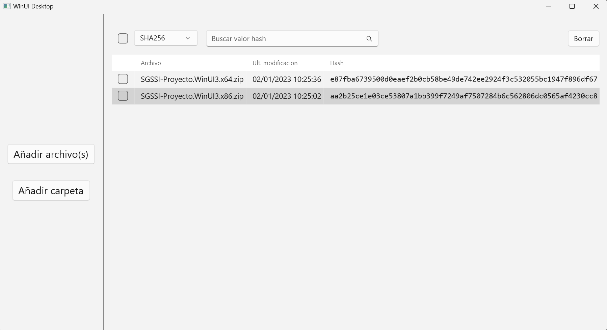
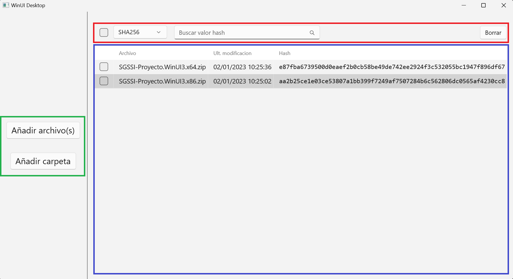

# Proyecto SGSSI
Esta aplicación se ha desarrollado como proyecto opcional de la asignatura Sistemas de Gestión de Seguridad de Sistemas de Información. Se trata de un programa para calcular resúmenes hash de archivos. Los algoritmos hash disponibles son: MD5, SHA1, SHA256, SHA384 y SHA512.

## Requerimientos
### Versión de Windows
La versión mínima soportada es 10.0.17763.0.
- Windows 10: A partir de la versión 1809 (13/11/2018)
- Windows 11: Cualquier versión

### .NET
Para ejecutar este programa hace falta tener .NET 6.0 o superior. Se puede obtener desde [Descargar .NET 6.0](https://dotnet.microsoft.com/es-es/download/dotnet/6.0) en la sección "Entorno de ejecución de escritorio de .NET" (.NET Desktop Runtime), seleccionando la arquitectura necesaria ([32 bits (x86)](https://dotnet.microsoft.com/es-es/download/dotnet/thank-you/runtime-desktop-6.0.12-windows-x86-installer) o [64 bits (x64)](https://dotnet.microsoft.com/es-es/download/dotnet/thank-you/runtime-desktop-6.0.12-windows-x64-installer)). [¿Cómo puedo saber si mi equipo ejecuta una versión de Windows de 32 bits o 64 bits?](https://support.microsoft.com/es-es/windows/windows-de-32-y-64-bits-preguntas-frecuentes-c6ca9541-8dce-4d48-0415-94a3faa2e13d).

También se puede instalar a través del administrador de paquetes winget usando el comando `winget install Microsoft.DotNet.DesktopRuntime.6`.

## Instalación
Para ejecutar este programa no hace falta realizar ninguna instalación, los pasos a seguir son los siguientes:
- descargar el fichero .zip correspondiente (x86 o x64) desde la sección [releases](https://github.com/MrAsieru/SGSSI-Proyecto/releases/latest)
- extraer el fichero comprimido en una carpeta
- ejecutar el archivo ejecutable SGSSI-Proyecto.WinUI3.exe

## Uso
La interfaz se divide en tres zonas:

1. Añadir archivos. Se pueden añadir archivos de dos formas, eligiendo archivos o carpetas. 

2. Seleccionar el algoritmo hash, realizar una búsqueda de hash, y borrar archivos de la lista. Además, al elegir dos o más archivos en la tabla, aparece un texto indicando si los resúmenes de los archivos seleccionados son iguales o no.

3. Tabla de archivos. Por cada archivo aparece su nombre, dirección absoluta al posar el ratón, fecha de última modificación, y valor hash del algoritmo seleccionado con posibilidad de copiar el valor. Las filas se pueden ordenar al hacer clic en los nombres de las columnas.